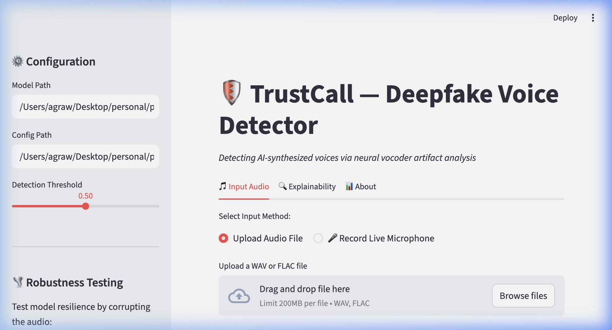

# 🛡️ TrustCall — Deepfake Voice Detection


TrustCall is an open-source AI system designed to detect synthetic and deepfake audio, addressing the growing risk of voice-based impersonation and fraud.

As generative voice models become more accessible, verifying the authenticity of audio is becoming a critical problem in security, media, and communication systems. TrustCall provides a reproducible and explainable pipeline for detecting AI-generated speech using raw waveform analysis and interpretable deep learning.

---

## 🌍 Why This Matters

AI-generated voice is increasingly used in scams, misinformation, and identity impersonation. Current detection systems are often opaque, difficult to reproduce, or not accessible to developers.

TrustCall aims to:
- Provide an open and transparent deepfake detection pipeline
- Enable developers to integrate voice authenticity checks into applications
- Advance research in explainable audio forensics

This project is part of a broader effort toward building trustworthy AI systems.

---

## 📸 Demo / Screenshots



*(A highly interactive Streamlit Dashboard featuring live microphone input, real-time waveform visualization, and automated deepfake detection.)*

---

## 🚀 Features

- **Raw Waveform Analysis**: Detects synthesized AI voices directly from raw audio waveforms using a modified RawNet2 architecture.
- **Explainable AI (XAI)**: Visualizes model decisions natively with SincConv frequency filters and saliency maps.
- **Live Voice Detection**: Supports real-time microphone recording and voice uploads handled directly in the browser.
- **Contextual Transcriptions**: Fully automated dictation and speech-to-text powered by OpenAI Whisper.
- **Robust Defense & Audits**: Includes interactive data augmentations (reverb, noise, compression) and LFCC-LCNN ensemble voting for maximum accuracy.

---

## 🏗️ Tech Stack

- **Python 3.10+** (Core programming language)
- **PyTorch** (Deep Learning framework)
- **Streamlit** (Interactive unified frontend dashboard)
- **OpenAI Whisper** (Speech-to-Text inference)
- **Librosa / SoundFile** (Audio Digital Signal Processing)
- **Matplotlib** (Scientific XAI plotting and visualization)

---

## ⚙️ Installation & Setup

You can easily get TrustCall running locally on your machine in three steps:

```bash
git clone https://github.com/akshat333-debug/trustcall
cd trustcall
pip install -r requirements.txt
```

---

## ▶️ Usage

The best way to interact with TrustCall is through the visual dashboard. 

```bash
# Launch the interactive web dashboard
streamlit run app/demo.py
```

1. Open your browser to `http://localhost:8501`.
2. Select either **"Upload Audio"** or **"Record Live Microphone"**.
3. TrustCall will automatically transcribe your speech, map the Mel Spectrograms, and determine if the voice is highly likely to be a deepfake.

---

## 📂 Project Structure

```text
├── app/                  # Streamlit Dashboard and UI components
├── configs/              # Model and training YAML configurations
├── data/                 # Datasets and loaders (ASVSpoof 2019)
├── outputs/              # Pretrained model weights and metric logs
├── augment.py            # Audio data augmentation (noise, reverb)
├── benchmark.py          # Latency & throughput speed profiling
├── cross_eval.py         # Cross-dataset generalization metrics
├── ensemble.py           # LFCC-LCNN feature logic and ensemble weighting
├── explain.py            # Core Explainable AI Visualizations (Saliency)
├── model.py              # RawNet2 PyTorch Architecture & SincConv Layer
├── predict_dataset.py    # Metric exports and JSON prediction generation
├── train_rawnet.py       # Core ASVSpoof 2019 Neural Training Script
├── visualize.py          # Mathematical Chart generation (EER, ROC)
├── requirements.txt      # Python dependencies
└── README.md             # Project documentation
```

---

## 🧪 Results / Output

TrustCall was natively trained end-to-end on the ASVspoof 2019 LA dataset at **16,000 Hz**, allowing its SincConv filters to achieve competitive performance compared to baseline benchmarks on ASVspoof 2019.

| Dataset | EER (Generic Benchmark) | EER (Our 16kHz Training) | Test Accuracy | Dev EER |
|---------|-------------------------|--------------------------|---------------|---------|
| ASVspoof 2019 | 4.54% | **4.19%** | **95.20%** | **1.25%** |

---

## 🔮 Future Improvements

- **Cloud Deployment**: Host the Streamlit application on AWS EC2 or Streamlit Community Cloud for public access.
- **REST API Integration**: Build a generic FastAPI endpoint for programmatic JSON access, allowing mobile apps to query TrustCall on-the-go.
- **Cross-Lingual Synthetics**: Expand the training dataset to include ASVSpoof 2021 and multilingual AI-synthesized datasets like ElevenLabs clones.
